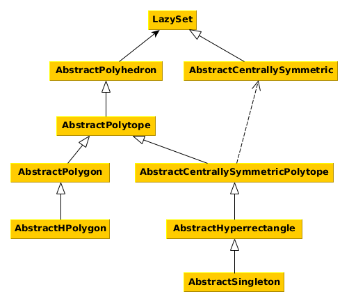

# Set interfaces

This section of the manual describes the interfaces for different set types.
Every set that fits the decsription of an interface should also implement it.
This helps in several ways:
- avoid code duplicates,
- provide functions for many sets at once,
- allow changes in the source code without changing the API.
The interface functions are outlined in the interface documentation.
See [Common Set Representations](@ref) for implementations of the interfaces.

Naming convention:
All interface names (with the exception of the main set interface) should be
preceded by `Abstract`.

The following diagram shows the interface hierarchy.



```@contents
Pages = ["interfaces.md"]
Depth = 4
```

```@meta
CurrentModule = LazySets
```

## LazySet

Every convex set in this library implements the main `LazySet` interface.

```@docs
LazySet
```

## Polytope

A polytope has finitely many vertices (*V-representation*) resp. facets
(*H-representation*).
Note that there are also [Point symmetric polytopes](@ref).

```@docs
AbstractPolytope
```

### Polygon

A polygon is a two-dimensional polytope.

```@docs
AbstractPolygon
```

#### HPolygon

An HPolygon is a polygon in H-representation (or constraint representation).

```@docs
AbstractHPolygon
```

## Point symmetric set

Point symmetric sets such as balls of different norms are characterized by a
center.
Note that there are also [Point symmetric polytopes](@ref).

```@docs
AbstractPointSymmetric
```

## Point symmetric polytope

A point symmetric polytope is a combination of two other interfaces:
[Point symmetric set](@ref) and [Polytope](@ref).

```@docs
AbstractPointSymmetricPolytope
```

### Hyperrectangle

A hyperrectangle is a special point symmetric polytope with axis-aligned facets.

```@docs
AbstractHyperrectangle
```

### Singleton

A singleton is a special hyperrectangle consisting of only one point.

```@docs
AbstractSingleton
```